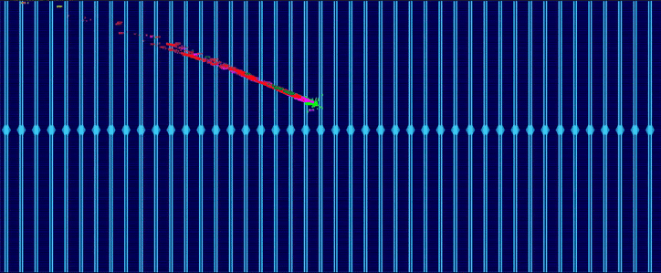
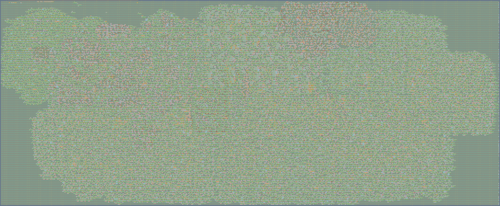

# Borg - Tiny Open Source Graphics Processing Unit

   

## Foundational workflow for an open-source GPU

The Borg (**B**ring yer **O**wn **GR**aphics) project—supported by [NLnet](https://nlnet.nl/project/Borg)—is
establishing a fully transparent, end-to-end silicon implementation flow for open-source GPU hardware using
a 100% libre EDA toolchain.
Recognizing that full GPU development is highly complex, the initiative capitalizes on recent
advances in low-cost chip manufacturing to make individual tape-outs feasible for small teams.

📖 Read the [Borg GPU Book](https://gonsolo.github.io/Borg/) for detailed documentation.


### ASIC Global Placement Evolution



*100-frame placement animation from the OpenROAD EDA toolchain. Colors indicate functional Chisel modules.*
<!-- markdownlint-restore MD033 -->

## Architecture

The design is a **Hutt RISC-V SoC** with the **Borg FP16 shader processor** as a memory-mapped peripheral,
targeting ECP5 FPGAs (ULX3S) and ASIC (IHP SG13G2 via Tiny Tapeout).

### Borg Shader Processor

A minimal programmable shading unit with:

- **FP16 Fused Multiply-Add (FMA)** — IEEE-754 compliant HardFloat unit supporting ADD, MUL, FMA, FNEG, FSTEP, and FRCP operations
- **32 general-purpose FP16 registers** (r0–r31), MMIO-accessible from the CPU
- **56-word instruction memory** for shader programs
- **Hardware FP16 reciprocal (RCP)** — LUT + linear interpolation for perspective division
- **Hardware Tile Buffer** — 16-pixel buffer for RGB and Z-buffer depth testing
- **Hardware Texture Unit** — Morton-encoded texture coordinate expansion
- **4-cycle pipeline** with automatic halt-on-zero-instruction

### Rendering Pipeline

The firmware implements a full triangle rendering pipeline:

1. **Vertex Shader** — 4×4 MVP matrix multiply with hardware perspective division, executed as a single shader pass on the Borg FPU
2. **Screen-Space Translation** — NDC to pixel coordinates with configurable framebuffer resolution
3. **Rasterization** — Hardware-iterator driven edge evaluation with native FP16 coordinate expansion and FSM auto-chaining
4. **Fragment Shader** — Unified pass (compiled via linear scan allocator) performing barycentric interpolation for RGB, Z, and UV simultaneously
5. **Hardware Z-Buffer** — Per-pixel depth testing in the hardware tile buffer
6. **Hardware Texturing** — Morton-encoded texel fetch with snooped fragment coordinates
7. **Framebuffer Output** — Results written to PSRAM, read by host (RP2040) for display

### SPIR-B Shader Format

Shaders are compiled from GLSL-like source to a compact binary format (SPIR-B) and loaded at runtime from PSRAM — no firmware reflash needed to change shaders.

### SystemRDL & Hardware Command FIFO

The MMIO architecture is generated automatically via the Accellera **SystemRDL** standard using `PeakRDL-chisel`, emitting both the Chisel `BorgGpuRegs` layout and the C-headers directly.

It features an asynchronous 2-entry **Command FIFO** so the CPU can pack and queue asynchronous drawing packets while the GPU handles geometry and rasterization in the background.

### Hutt CPU

A clean multi-cycle **RV32I** RISC-V core written in Chisel with fully **Decoupled** instruction and data buses. Hutt integrates seamlessly with the `MemoryController` (arbitrating QSPI flash and SDRAM) and routes MMIO via `SoCDecode` to inline SoC registers, the user peripheral router, and the Borg peripheral bus. Verified on ULX3S hardware.

## Prerequisites

- [Nix](https://nixos.org)
- [Git](https://git-scm.com)
- [Make](https://www.gnu.org/software/make)

## Building and Testing

### Run all tests (Chisel + RTL cocotb)

```bash
make test-all
```

### Individual test targets

```bash
make test-chisel-borg          # Borg FPU unit tests (Chisel)
make test-chisel-core          # Hutt CPU tests (Chisel)
make test-cocotb-soc-core-rtl  # CPU SoC integration tests (cocotb)
make test-cocotb-soc-borg-rtl  # Borg peripheral tests (cocotb)
```

### Vulkan Conformance (CTS)

The host Vulkan driver, **borgvk**, runs against the official Khronos
[VK-GL-CTS](https://github.com/KhronosGroup/VK-GL-CTS) (`dEQP-VK`):

```bash
make vulkan-cts   # → "borgvk: passed 5936 of 1647405 mandatory Vulkan CTS tests = 0.360%"
```

By default this runs the `dEQP-VK.api.info.*` query class (~8,200 cases), of which
borgvk passes **5,936** (72.5%) with **0 failures**. borgvk is a narrow driver — it
renders one hand-compiled cube over serial to the FPGA — so the cases that pass are
the **query/setup** ones (device/format/limit/format-properties enumeration, object
creation) that exercise borgvk's instance/device paths through the Mesa runtime
without touching the serial→FPGA pipeline. Rendering classes (`dEQP-VK.draw.*`, …)
fail. It is an honest "the API surface works" data point, not a conformance claim.

Running CTS also surfaces real driver bugs: it caught a `NULL`-dispatch segfault in
`vkGetPhysicalDeviceSparseImageFormatProperties2`, whose fix turned the
`api.info.sparse_image_format_properties2.*` group from a crash into ~1,500 passes.
A second pass fixed `VkFormatProperties3` pNext propagation, YCbCr format feature
restrictions, `VK_FORMAT_UNDEFINED` handling, 3D image `maxArrayLayers`, MSAA
`sampleCounts` consistency, and missing Vulkan 1.0–1.3 required limits — moving the
score from ~4,000 to 5,936.

Requires a built `deqp-vk` and the borgvk ICD; see
[The Software Driver](docs/03_software_driver.md) for the one-time build steps.
Run a different slice with `make vulkan-cts VK_CTS_CASE='dEQP-VK.api.device_init.*'`,
or point at a checkout elsewhere with `make vulkan-cts VK_GL_CTS=/path/to/VK-GL-CTS`.

### Cycle-Accurate C++ Simulation & Interactive Pygame UI

Fast C++ simulators for RTL validation, capable of rendering frames locally without an FPGA, featuring a real-time cycle-accurate interactive view.

```bash
make -C simulation/verilator vkcube_gui # Run vkcube in the interactive Verilator viewer
make -C simulation/arcilator vkcube_gui  # Run in the faster Arcilator viewer
```

### FPGA (ULX3S — ECP5)

Prerequisites: ULX3S board.

```bash
cd fpga/ulx3s
make load           # Synth + P&R + load to SRAM
make flash          # Write to config flash
make tio            # Open serial console on /dev/ttyUSB0
```

### ASIC (Tiny Tapeout)

<p align="center">
  
</p>

```bash
make gds            # Full RTL-to-GDS flow via LibreLane/OpenROAD
```

## Milestones

| Milestone | Status |
| --- | --- |
| FPU integrated into Hutt SoC | ✅ Done |
| Vertex shader on FPGA | ✅ Done |
| Triangle rasterization + fragment shading | ✅ Done |
| SPIR-B runtime shader loading | ✅ Done |
| Per-vertex color interpolation | ✅ Done |
| Hardware Tile Buffer (Z-Buffer depth test) | ✅ Done |
| Hardware Texture Address Unit (Morton encoding) | ✅ Done |
| 32-bit RISC-V instructions & 32-entry register file | ✅ Done |
| Hardware perspective projection (4×4 MVP shader) | ✅ Done |
| Hardware FP16 reciprocal (FRCP) | ✅ Done |
| Cycle-accurate C++ simulation (Arcilator & Verilator) | ✅ Done |
| Interactive UI Viewer (zero-copy Pygame) | ✅ Done |
| Test manufactured chip | ⏳ Pending |
| Vulkan driver | 📋 Planned |

## Software Bill of Materials

| Component | Description | License |
| --- | --- | --- |
| [Chisel](https://github.com/chipsalliance/chisel) | Hardware construction language (Scala → Verilog) | Apache-2.0 |
| Hutt | RV32I RISC-V CPU core (multi-cycle, Chisel, Decoupled buses) | CERN-OHL-S-2.0 |
| [Berkeley HardFloat](https://github.com/ucb-bar/berkeley-hardfloat) | IEEE-754 floating-point units (FMA) | BSD-3-Clause |
| [LibreLane](https://github.com/efabless/librelane) | RTL-to-GDS ASIC flow orchestrator | Apache-2.0 |
| [Yosys](https://github.com/YosysHQ/yosys) | RTL synthesis | ISC |
| [OpenROAD](https://github.com/The-OpenROAD-Project/OpenROAD) | Place and route | BSD-3-Clause |
| [Magic](https://github.com/RTimothyEdwards/magic) | Layout tool, DRC, GDS export | MIT |
| [KLayout](https://github.com/KLayout/klayout) | GDS viewer and DRC | GPL-2.0 |
| [IHP SG13G2 PDK](https://github.com/IHP-GmbH/IHP-Open-PDK) | IHP 130nm process design kit | Apache-2.0 |
| [cocotb](https://github.com/cocotb/cocotb) | Python-based RTL simulation and testing | BSD-3-Clause |
| [Icarus Verilog](https://github.com/steveicarus/iverilog) | Verilog simulation (cocotb backend) | GPL-2.0 |
| [Verilator](https://github.com/verilator/verilator) | Verilog linting and simulation | LGPL-3.0 |
| [nextpnr](https://github.com/YosysHQ/nextpnr) | FPGA place and route (iCE40) | ISC |
| [IceStorm](https://github.com/YosysHQ/icestorm) | iCE40 FPGA bitstream tools | ISC |
| [Netgen](https://github.com/RTimothyEdwards/netgen) | LVS (Layout vs. Schematic) | MIT |
| [GCC](https://gcc.gnu.org/) | RISC-V cross-compiler (`riscv32-embedded`) | GPL-3.0 |
| [Mill](https://github.com/com-lihaoyi/mill) | Scala build tool | MIT |
| [Tiny Tapeout Tools](https://github.com/TinyTapeout/tt-support-tools) | Build and submission orchestrator | Apache-2.0 |
| [Nix](https://github.com/NixOS/nix) | Reproducible development environment | LGPL-2.1 |
| [CIRCT/firtool](https://github.com/llvm/circt) | Chisel → Verilog compiler (FIRRTL) | Apache-2.0 (LLVM) |
| [Arcilator](https://github.com/llvm/circt) | Cycle-accurate FIRRTL C++ simulator | Apache-2.0 (LLVM) |
| [OpenJDK](https://openjdk.org/) | Java runtime for Chisel/Mill | GPL-2.0 + CE |
| [SystemRDL](https://www.accellera.org/downloads/standards/systemrdl) | Register logic definition standard | Accellera |
| [PeakRDL](https://github.com/SystemRDL/PeakRDL) | Toolchain for parsing and exporting SystemRDL | GPL-3.0 |
| [nanobind](https://github.com/wjakob/nanobind) | Zero-overhead C++ to Python bindings | BSD-3-Clause |
| [Pygame (SDL2)](https://github.com/pygame/pygame) | Hardware-accelerated UI windowing subsystem | LGPL-2.1 |

## Citation

If you use the Borg GPU in your research or project, please cite the HPG 2026 poster:

```bibtex
@misc{Wendleder_Borg_2026,
  author    = {Wendleder, Andreas},
  title     = {{Borg (Bring yer Own GRaphics): An Open-Source Tile-Based GPU with Silicon Tapeout}},
  howpublished = {Poster presented at High-Performance Graphics (HPG) 2026},
  month     = jul,
  year      = {2026},
  url       = {https://github.com/gonsolo/Borg},
}
```

Alternatively, see the [CITATION.cff](CITATION.cff) file for machine-readable citation information.
