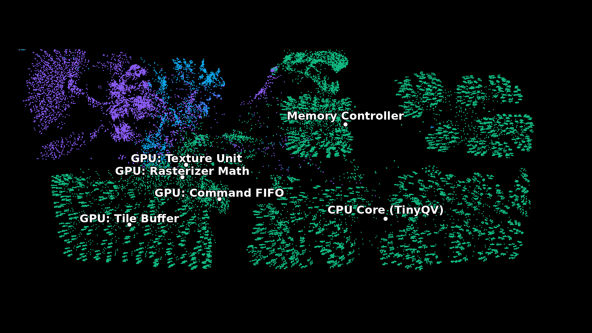

# Generating the ASIC


The design targets the IHP SG13G2 130nm process via the
[Tiny Tapeout](https://tinytapeout.com/) program. The RTL-to-GDS flow uses
entirely open-source tools.

## The Flow

The ASIC build comes in two flavours:

```
make gds-sky130   # Sky130 via LibreLane/OpenROAD
make gds-ihp      # IHP SG13G2 via LibreLane/OpenROAD
```

This invokes [LibreLane](https://github.com/efabless/librelane), which
orchestrates the full flow:

1. **Synthesis** (Yosys) — Chisel-generated Verilog → gate-level netlist
2. **Floorplanning** (OpenROAD) — die size, power grid, pin placement
3. **Global Placement** (OpenROAD) — initial cell positions
4. **Clock Tree Synthesis** (OpenROAD) — balanced clock distribution
5. **Detailed Placement** (OpenROAD) — legal cell positions with density constraints
6. **Routing** (OpenROAD) — metal layer connections
7. **Timing Repair** — hold buffer insertion to meet timing
8. **GDS Export** (Magic/KLayout) — final layout for manufacturing

## Physical Organization

During the Global Placement phase, the OpenROAD placement algorithms dynamically organize the flattened Verilog into physical clumps based strictly on wire connectivity.

<p align="center">
  
  <br>
  <em>Frame 44 of the global placement process, annotated with the functional modules. Colors reflect the Chisel design blocks.</em>
</p>

The dense connectivity of the GPU datapath forces the Tile Buffer, Rasterizer Math, and Texture Unit into tight clusters on the left. The Command FIFO naturally acts as a physical bridge, dropping directly into the center between the Hutt CPU core and the GPU. The Memory Controller is pulled toward the top-right to interface with the external SPI pins.

## Configuration

The build is configured through `src/config.json`:

- `PL_TARGET_DENSITY_PCT` — maximum cell density (65% for this design)
- `CLOCK_PERIOD` — synthesis timing constraint in nanoseconds (40ns = 25 MHz)
- `PL_RESIZER_HOLD_SLACK_MARGIN` — slack margin for hold time repair

These parameters control the tradeoff between area utilization and timing closure.
A relaxed clock period reduces the number of hold buffers inserted during timing
repair, which in turn reduces area.

## Tile Size

The design occupies a 4×2 tile (8 tiles) on the TTIHP26a shuttle, providing
approximately 260,000 µm² of usable area. At 65% target density, the design
uses about 160,000 µm² — primarily flip-flops for the register files, instruction
memory, and pipeline state.

## Verification

The design is verified at multiple levels before tape-out:

- **Chisel unit tests** — functional correctness of Borg FPU and Hutt
- **cocotb RTL simulation** — full SoC integration tests
- **Verilator lint** — static analysis of the generated Verilog
- **FPGA validation** — real hardware testing on pico-ice
- **Gate-level simulation** — post-synthesis simulation with IHP standard cells

```
make test-all   # Run Chisel + cocotb tests
make lint       # Verilator lint check
```
