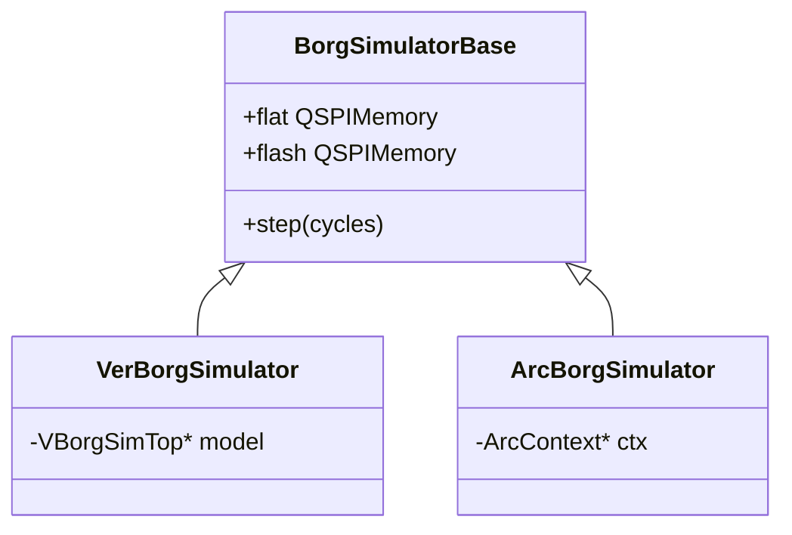

# Simulation

The Borg project uses a unified C++ simulation framework that provides cycle-accurate models of the hardware. The same simulation harness supports both **Verilator** (fast open-source RTL simulation) and **Arcilator** (extremely fast MLIR-based simulation).

## Unified Architecture

Rather than maintaining separate ad-hoc simulators for each backend, Borg uses a base class hierarchy that abstracts the specific RTL engine:



All simulators share the same cycle-accurate models of the flash and DRAM memories, including:
- 1MB Flash (read-only instruction storage)
- 8MB DRAM (framebuffer, z-buffer, textures)

This ensures that any software that runs in simulation will run identically on the physical FPGA hardware. The Hutt CPU accesses memory via Decoupled buses (HuttInstrBus/HuttBus); the MemoryController translates these to the QSPI backend. The verilator simulator exposes the MemoryController's flat MemBackendIO bus directly (no QSPI pins required).

## Backends

### Verilator
The standard backend. It compiles the Chisel-generated Verilog into a high-performance C++ model.
- **Usage**: `make -C simulation/verilator vkcube`
- **Speed**: ~500 kHz to 1 MHz on modern CPUs.

### Arcilator
A state-of-the-art backend that uses MLIR (Multi-Level Intermediate Representation) to optimize the hardware graph before compilation.
- **Usage**: `make -C simulation/arcilator vkcube`
- **Speed**: Generally 2x–4x faster than Verilator.

## Interactive Viewer

The C++ simulators are wrapped with **nanobind**, allowing them to be driven by a Python-based interactive viewer (`viewer.py`).

```bash
make -C simulation/verilator vkcube_gui
```

The viewer uses **Pygame** to display the simulated framebuffer in real-time. It runs the simulation in chunks (e.g., 200,000 cycles per UI frame) to keep the window responsive while the simulated GPU renders. It also supports mouse-driven rotation by snooping the DRAM uniform memory and updating the camera's MVP matrix.

## Hardware Parity

To maintain 100% parity with the FPGA, the simulators:
1. **Reset Sequence**: Execute the same multi-cycle reset protocol as the hardware.
2. **UART Logic**: Capture and decode UART output from the Hutt CPU for console logging.
3. **BRAM Initialization**: Manually initialize internal hardware BRAMs (like coordinate LUTs) from `.hex` files, mirroring the `$readmemh` behavior of FPGA synthesis tools.

## Debugging

The simulation generates several artifacts for debugging:
- `trace.vcd`: (Verilator only) Waveform trace for logic analysis in GTKWave.
- `state.json`: (Arcilator only) A snapshot of all internal registers and memory offsets.
- `*.ppm`: Snapshots of the framebuffer taken at the end of rendering.


