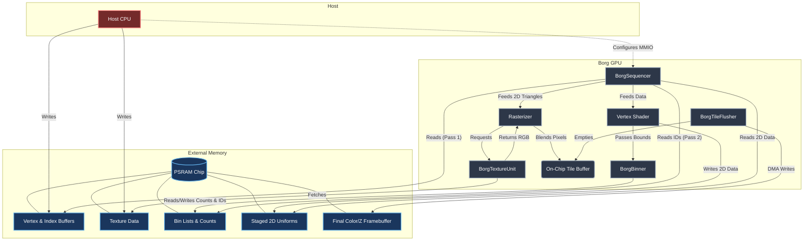
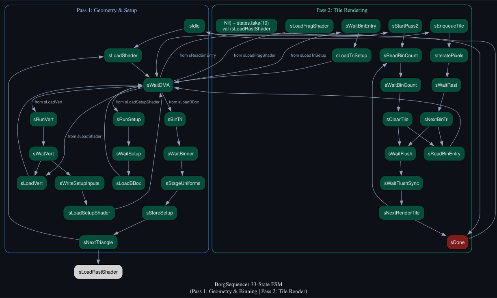

# Tile-Based Rendering

Borg uses a **Tile-Based Rendering (TBR)** architecture — the same fundamental
approach used by virtually every modern mobile GPU (ARM Mali, Apple GPU, Qualcomm
Adreno, Imagination PowerVR). This chapter explains why TBR exists, how Borg
implements it in hardware, and how the autonomous sequencer orchestrates both
rendering passes without CPU intervention.

## Why Tile-Based?

The naive approach to 3D rendering is **immediate mode**: process each triangle
in submission order, rasterize its pixels directly into the framebuffer in PSRAM,
and perform depth testing with a read-modify-write on every pixel.

This is expensive. PSRAM access is slow (QSPI, ~20× slower than on-chip SRAM)
and every depth test requires a round-trip: read the stored Z, compare, write
back if closer. For a 128×128 framebuffer at 4× overdraw (a typical scene), that
means ~65,000 PSRAM accesses *per frame* just for depth testing.

TBR avoids this by splitting rendering into two passes:

1. **Geometry pass** — process all triangles, bin them by which screen tiles they
   overlap. Store pre-computed per-triangle data in PSRAM.
2. **Tile render pass** — render one tile at a time. All rasterization and depth
   testing happens in a small, fast on-chip SRAM buffer. The result is flushed to
   PSRAM *once* per tile when complete.

The key insight: PSRAM is only written once per tile per frame, regardless of how
many triangles overlap that tile. Depth testing is free (on-chip).

## Architecture and Data Flow

The fully autonomous TBR architecture heavily leverages external PSRAM, while keeping depth-testing and pixel blending strictly on-chip.

### 1. Timing & Data Flow (Sequence)

This shows the step-by-step order of operations over time. Notice how heavily the GPU relies on PSRAM during Phases 1 and 2.

```mermaid
sequenceDiagram
    participant C as Host CPU
    participant G as Borg GPU
    participant P as PSRAM (External Memory)
    
    rect rgb(40, 40, 40)
    note right of C: PHASE 0: SETUP
    C->>P: 1. Write 3D Vertices, Indices, Textures
    C->>G: 2. Write MMIO config & trigger Start
    end
    
    rect rgb(30, 45, 60)
    note right of C: PHASE 1: GEOMETRY BINNING (Loops per Triangle)
    loop For Every Triangle
        G->>P: 3. Read 3 Indices & 3 Vertices
        note over G: Vertex Shader transforms 3D → 2D
        G->>P: 4. Write transformed 2D Uniforms (Staging)
        note over G: Binner finds overlapping 4x4 tiles
        G->>P: 5. Read/Write Tile Bin Lists & Triangle Counts
    end
    end
    
    rect rgb(60, 30, 30)
    note right of C: PHASE 2 & 3: RASTERIZATION (Loops per 4x4 Tile)
    loop For Every 4x4 Tile
        G->>P: 6. Read Bin List for this tile
        loop For Every Overlapping Triangle
            G->>P: 7. Read 2D Uniforms (from Staging)
            note over G: Rasterizer tests 16 pixels
            opt If Texturing Enabled
                G->>P: 8. Fetch Texels
            end
            note over G: Blend colors/depths into On-Chip Tile Buffer
        end
        note right of C: Phase 3: Tile Flush
        G->>P: 9. DMA Write 16 finished pixels to Framebuffer
    end
    end
```



### 2. Architecture Layout

This shows exactly which internal Borg GPU hardware blocks map to which physical regions in PSRAM.



**Legend of Components:**
- **CPU (Phase 0 Only)**: The host processor that sets up 3D data and triggers the GPU. Once triggered, the CPU goes to sleep.
- **SEQ (BorgSequencer, Phases 1-3)**: The master GPU hardware FSM that fetches memory and orchestrates the autonomous rendering passes.
- **VSH (Vertex Shader)**: Executes `TinyQV` to transform 3D vertices into 2D screen coordinates.
- **BINNER (BorgBinner)**: Determines which 4x4 tiles a triangle overlaps and updates PSRAM bin lists.
- **RAST (Rasterizer)**: Evaluates edge equations for 16 pixels concurrently to determine triangle inclusion.
- **TEXU (BorgTextureUnit)**: Fetches and filters texels from PSRAM for textured fragments.
- **TBUF (BorgTileBuffer)**: On-chip SRAM holding the current 4x4 tile's Color and Z values for fast blending.
- **FLUSH (BorgTileFlusher)**: Bursts the finished 16 pixels from TBUF to the PSRAM framebuffer.

## Memory Layout

```text
PSRAM address space:
─────────────────────────────────────────────────────────
  0x85000 +  framebuffer:   fb_width × fb_height pixels × 2 words (lo/hi)
           ├─ lo word:      { B[31:16], Z[15:0] }
           └─ hi word:      { R[31:16], G[15:0] }
─────────────────────────────────────────────────────────
  tbr_bin_base:
  bin list:    num_tiles × SEQ_MAX_TRI × 2 bytes (triangle indices, uint16)
               Each tile has one row: bin_list[tile][0..count-1]
─────────────────────────────────────────────────────────
  tbr_setup_base:
  setup store: SEQ_MAX_TRI × 128 bytes (31 FP16 uniforms per triangle)
               addr = setupBase + triIdx × 128
─────────────────────────────────────────────────────────
```

Per-tile triangle counts live in an **on-chip `SyncReadMem`** inside `BorgBinner`
(up to 1024 tiles × 10-bit counter). They are never written to PSRAM — the
sequencer queries them directly via the `countRead` port.

## Pass 1: Geometry Pass

For each triangle (driven by `BorgSequencer`):

```text
sLoadShader → sRunVert (×3 vertices)
  sWriteSetupInputs → sLoadSetupShader → sRunSetup
    sLoadBBox → sBinTri → sWaitBinner
      sStageUniforms → sStoreSetup
        sNextTriangle
```

| State | What happens |
| --- | --- |
| `sRunVert` | Vertex shader: NDC → screen-space position (×3 vertices) |
| `sRunSetup` | Setup shader: edge vectors, signed area, inv_area |
| `sLoadBBox` | DMA-read tile-aligned bounding box from descriptor |
| `sBinTri` | Trigger `BorgBinner`: writes triangle index to PSRAM bin list for every tile in bbox |
| `sStageUniforms` | Compute 31 uniforms (edge constants, vertex positions, colors, z) → write to uniform buffer |
| `sStoreSetup` | DMA-write all 31 uniforms to PSRAM setup store at `setupBase + tri × 128` |

After all triangles are processed, Pass 1 is complete. No rasterization occurs.

## The BorgBinner

`BorgBinner` is a small autonomous FSM that runs once per triangle during Pass 1.
Given a triangle index and its tile-aligned bounding box, it iterates over every
tile in the bbox and writes the triangle's index to that tile's bin list in PSRAM.

```text
sIdle → sReadCount → sWaitCount → sWritePsram → sStoreCount → sNextTile → ...
```

- **sReadCount**: reads the current triangle count for the tile from on-chip SRAM.
- **sWritePsram**: writes `triIdx` (uint16) to `binBase + tile × binRowBytes + count × 2`.
- **sStoreCount**: increments and stores the count back to on-chip SRAM.

Per-tile counts are stored in a `SyncReadMem(1024, UInt(10.W))` — 10 bits supports
up to 1023 triangles per tile. Counts are zeroed once per frame at `sIdle` via the
`clearCounts` pulse.

The binner has **lowest PSRAM priority** in the arbitration mux
(DMA > Flusher > Geo > Rast), but in practice it only runs during geometry pass
when the rasterizer and flusher are both idle — so contention never occurs.

## Pass 2: Tile Render Pass

Once all triangles are binned, shaders are loaded once into IMEM and the sequencer
iterates every framebuffer tile:

```text
sStartPass2 → sReadBinCount → sWaitBinCount → sClearTile
  │  (binTriCount == 0)          └──────────→ sWaitFlush → sWaitFlushSync → sNextRenderTile
  │  (binTriCount > 0)
  └─ sReadBinEntry → sWaitBinEntry → sLoadTriSetup → sEnqueueTile
       → sIteratePixels → sWaitRast → sNextBinTri → (loop or sWaitFlush)
```

**Empty tiles** (binTriCount == 0) skip the inner triangle loop entirely and flush
the clear-filled tile buffer directly. No stale data from a previous frame is ever
visible — every tile is flushed every frame.

**Shader IMEM** stays loaded across all tile iterations. Only the 31 setup uniforms
change per triangle (loaded from the PSRAM setup store). This avoids the IMEM
reload cost from Step 31.

## Sequencer FSM State Count

| Step | States added | Total |
| --- | --- | --- |
| 29: Vertex sequencer | sIdle … sWaitSetup (10) | 10 |
| 29.3: Uniform staging | sStageUniforms | 11 |
| 31.2: Shader reload | sLoadRastShader, sLoadFragShader | 13 |
| 31.4: Tile iteration | sLoadBBox, sClearTile, sEnqueueTile … sNextTile | 21 |
| 31.3: Triangle loop | sNextTriangle | 22 |
| 32.2: Binning | sBinTri, sWaitBinner | 24 |
| 32.3: Two-pass TBR | sStoreSetup, sStartPass2, sReadBinCount, sWaitBinCount, sReadBinEntry, sWaitBinEntry, sLoadTriSetup, sNextBinTri, sNextRenderTile | **33** |

## Sequencer FSM States



| State | Pass | Description |
| --- | --- | --- |
| `sIdle` | Pass 1 | Wait for MMIO trigger to begin rendering. |
| `sLoadShader` | Pass 1 | Load vertex shader binary from PSRAM into IMEM via DMA |
| `sWaitDMA` | Pass 1 | Wait for DMA transfer to complete |
| `sLoadVert` | Pass 1 | Load full vertex data (8 FP16 words: x,y,z,r,g,b,u,v) from descriptor. Descriptor stride is 128 bytes. Vertex i is at descBase + triIdx*128 + i*32 bytes. DMA writes all 8 words to uniform[0..7] in uniform page 0. During the wait, sWaitDMA snoops uniform writes to colorRegs (see below). |
| `sRunVert` | Pass 1 | Trigger vertex shader execution on BorgCore at PC=0 |
| `sWaitVert` | Pass 1 | Wait for vertex shader to finish; snoop clip-space outputs (x,y into clipRegs) |
| `sWriteSetupInputs` | Pass 1 | Write 6 screen-space coordinates from clipRegs into uniform buffer, plus inv_width as u6 for edge normalization (Step 30.1c). u0=v0.x, u1=v0.y, u2=v1.x, u3=v1.y, u4=v2.x, u5=v2.y, u6=inv_width |
| `sLoadSetupShader` | Pass 1 | Load setup shader from PSRAM into IMEM via DMA |
| `sRunSetup` | Pass 1 | Trigger setup shader execution on BorgCore at PC=0 |
| `sWaitSetup` | Pass 1 | Wait for setup shader to finish; snoop outputs into setupRegs |
| `sLoadBBox` | Pass 1 |  |
| `sBinTri` | Pass 1 | Trigger BorgBinner for this triangle |
| `sWaitBinner` | Pass 1 | Wait for BorgBinner to finish writing all tile bins for this triangle. |
| `sStageUniforms` | Pass 1 | Write all 31 uniform registers (u0-u30) to replace setup_tile_uniforms(). Physical uniform indices match the fixed SPIRB layout: u0-u5:  scaled edge components from setupRegs[0..5] u6-u11: negated vertex positions from FNEG(clipRegs[v][c]) u12:    inv_area from setupRegs[7] u13-u21: colors in barycentric order (v1,v0,v2) × RGB u22-u24: z_vals (z of v1, v0, v2) u25-u30: 0 (UVs — not yet implemented) |
| `sStoreSetup` | Pass 1 | Write all 31 uniform values (latched in uDataStore) to PSRAM at setupBase + triIdx *128 + storeWriteIdx* 4. Each value is stored as a 32-bit word (low 16 bits = uniform, high = 0). |
| `sNextTriangle` | Pass 1 | Pass 1: Triangle loop Advance to next triangle, or start Pass 2 |
| `sIdle` | Pass 2 | Wait for MMIO trigger to begin rendering. |
| `sLoadShader` | Pass 2 | Load vertex shader binary from PSRAM into IMEM via DMA |
| `sWaitDMA` | Pass 2 | Wait for DMA transfer to complete |
| `sLoadVert` | Pass 2 | Load full vertex data (8 FP16 words: x,y,z,r,g,b,u,v) from descriptor. Descriptor stride is 128 bytes. Vertex i is at descBase + triIdx*128 + i*32 bytes. DMA writes all 8 words to uniform[0..7] in uniform page 0. During the wait, sWaitDMA snoops uniform writes to colorRegs (see below). |
| `sRunVert` | Pass 2 | Trigger vertex shader execution on BorgCore at PC=0 |
| `sWaitVert` | Pass 2 | Wait for vertex shader to finish; snoop clip-space outputs (x,y into clipRegs) |
| `sWriteSetupInputs` | Pass 2 | Write 6 screen-space coordinates from clipRegs into uniform buffer, plus inv_width as u6 for edge normalization (Step 30.1c). u0=v0.x, u1=v0.y, u2=v1.x, u3=v1.y, u4=v2.x, u5=v2.y, u6=inv_width |
| `sLoadSetupShader` | Pass 2 | Load setup shader from PSRAM into IMEM via DMA |
| `sRunSetup` | Pass 2 | Trigger setup shader execution on BorgCore at PC=0 |
| `sWaitSetup` | Pass 2 | Wait for setup shader to finish; snoop outputs into setupRegs |
| `sLoadBBox` | Pass 2 |  |
| `sBinTri` | Pass 2 | Trigger BorgBinner for this triangle |
| `sWaitBinner` | Pass 2 | Wait for BorgBinner to finish writing all tile bins for this triangle. |
| `sStageUniforms` | Pass 2 | Write all 31 uniform registers (u0-u30) to replace setup_tile_uniforms(). Physical uniform indices match the fixed SPIRB layout: u0-u5:  scaled edge components from setupRegs[0..5] u6-u11: negated vertex positions from FNEG(clipRegs[v][c]) u12:    inv_area from setupRegs[7] u13-u21: colors in barycentric order (v1,v0,v2) × RGB u22-u24: z_vals (z of v1, v0, v2) u25-u30: 0 (UVs — not yet implemented) |
| `sStoreSetup` | Pass 2 | Write all 31 uniform values (latched in uDataStore) to PSRAM at setupBase + triIdx *128 + storeWriteIdx* 4. Each value is stored as a 32-bit word (low 16 bits = uniform, high = 0). |
| `sNextTriangle` | Pass 2 | Pass 1: Triangle loop Advance to next triangle, or start Pass 2 |
| `Nil) = states.take(16)
  val (sLoadRastShader` | Pass 2 |  |
| `sLoadFragShader` | Pass 2 | Load frag shader from PSRAM into IMEM via DMA |
| `sStartPass2` | Pass 2 |  |
| `sReadBinCount` | Pass 2 | Read the bin count for the current tile from binner's on-chip SRAM. The count read was issued in the previous state (sStartPass2 or sNextRenderTile). SyncReadMem has 1-cycle latency, so wait one cycle. |
| `sWaitBinCount` | Pass 2 | Latch the count data (available now after the 1-cycle SyncReadMem read). |
| `sClearTile` | Pass 2 | Pulse tileCtrlClear for 16-cycle BRAM clear sequence |
| `sReadBinEntry` | Pass 2 |  |
| `sWaitBinEntry` | Pass 2 | Bin entry has been snooped by the DMA handler into binEntryData. Now DMA-load the triangle's setup uniforms from PSRAM. |
| `sLoadTriSetup` | Pass 2 | DMA-load the triangle's 31 setup uniforms from PSRAM into the uniform buffer. addr = setupBase + binEntryData * 128 |
| `sEnqueueTile` | Pass 2 | Enqueue tile coordinates for rasterizer |
| `sIteratePixels` | Pass 2 | Start rasterizer iteration over pixels |
| `sWaitRast` | Pass 2 | Wait for tileComplete (all pixels shaded) |
| `sWaitFlush` | Pass 2 | Trigger flusher: writes tile SRAM -> PSRAM |
| `sWaitFlushSync` | Pass 2 | Wait for flusher to finish |
| `sNextBinTri` | Pass 2 | Advance to next triangle in this tile's bin list, or flush |
| `sNextRenderTile` | Pass 2 | Advance to next tile in full-screen iteration |
| `sDone` | Pass 2 | Sequencer complete — pulse done for one cycle, return to idle |

## Hardware Components

```text
BorgSequencer (FSM, 33 states)
  ├── BorgDMA          — PSRAM burst read/write (vertex descs, shaders, bin entries, uniforms)
  ├── BorgBinner       — triangle→tile mapping, PSRAM bin list writes
  │     └── countMem   — SyncReadMem(1024, 10.W): per-tile triangle counts (on-chip)
  ├── BorgCore         — FP16 FMA shader processor (vertex + setup shaders in Pass 1)
  ├── BorgRasterizer   — edge-function iterator (fragment shading in Pass 2)
  ├── BorgTileBuffer   — 16-pixel on-chip SRAM (clear fill + depth test in Pass 2)
  └── BorgFlusher      — DMA tile SRAM → PSRAM (once per tile in Pass 2)
```

PSRAM arbitration priority (highest → lowest):

```text
DMA  >  Flusher  >  Geo (Binner + SeqStore)  >  Rasterizer
```

## Driver API

From the CPU's perspective, two-pass TBR is a single function call:

```c
// In borgCreateDevice(): compute TBR region bases after framebuffer
tbr_bin_base   = fb_end_spi;
tbr_setup_base = tbr_bin_base + num_tiles * TBR_BIN_ROW_BYTES;

// In borg_present() → borgBinRenderAutonomous():
BORG_GPU->seq_bin_base      = tbr_bin_base;    // PSRAM addr of bin lists
BORG_GPU->seq_bin_row_bytes = TBR_BIN_ROW_BYTES; // bytes per tile row
BORG_GPU->seq_setup_base    = tbr_setup_base;  // PSRAM addr of setup store
BORG_GPU->seq_tri_count     = draw_call_count;
BORG_GPU->seq_trigger       = 1;               // both passes run autonomously
while (BORG_GPU->status & STATUS_REG_T__SEQ_BUSY_bm);
```

The CPU triggers once and waits. Both passes — geometry binning and tile rendering
— run autonomously in hardware without further CPU involvement.

## Performance Characteristics

For a 128×128 framebuffer with 32 tiles (8×4) and 12 triangles (vk_cube scene):

| Metric | Immediate Mode | TBR |
| --- | --- | --- |
| PSRAM writes per frame | O(overdraw × pixels) | O(tiles × 32 words) = 1024 |
| Depth test cost | PSRAM round-trip | On-chip (free) |
| CPU involvement in render | Per-tile loop | **Zero** (autonomous) |
| Clear-fill PSRAM writes | `fb_w × fb_h × 2` | **0** (sClearTile on-chip) |

The clear-fill loop that previously dominated `borgBinRenderAutonomous()` (16,384
PSRAM writes for a 64×64 framebuffer) is now completely eliminated.
